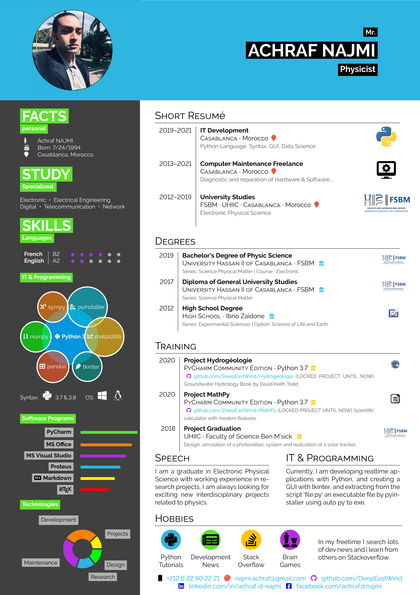
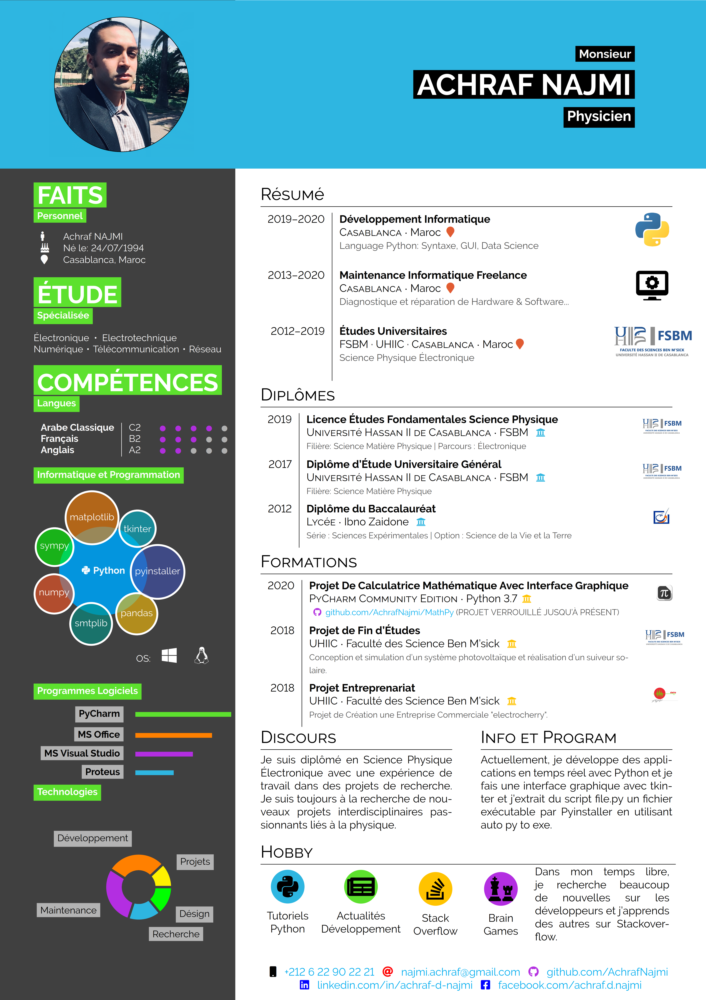

# hipster-cv
Repo to share the template for the Hipster-CV.

*Image credits for the example images goes to Disney!*
These images are in the CV just for demonstration.
Please replace them with your own photos and logos if you use this template!


# Previews
### CV ENGLISH
  

### CV FRANÇAIS
  

## Usage

This is how to invoke the different color themes

```latex
\documentclass[alldark]{hipstercv}
% insert whatever style you want to use where it says 'alldark' now:
% available are: verylight, pastel, alldark, grey, darkhipster, lighthipster
```

## License
These CV themes are licensed under a [Creative Commons Attribution-ShareAlike
4.0 International License](http://creativecommons.org/licenses/by-sa/4.0/). This
means that if you change the theme and re-distribute it, you *must* retain the
copyright notice header and license it under the same CC-BY-SA license. This
does not affect the CV that you create with the theme.

