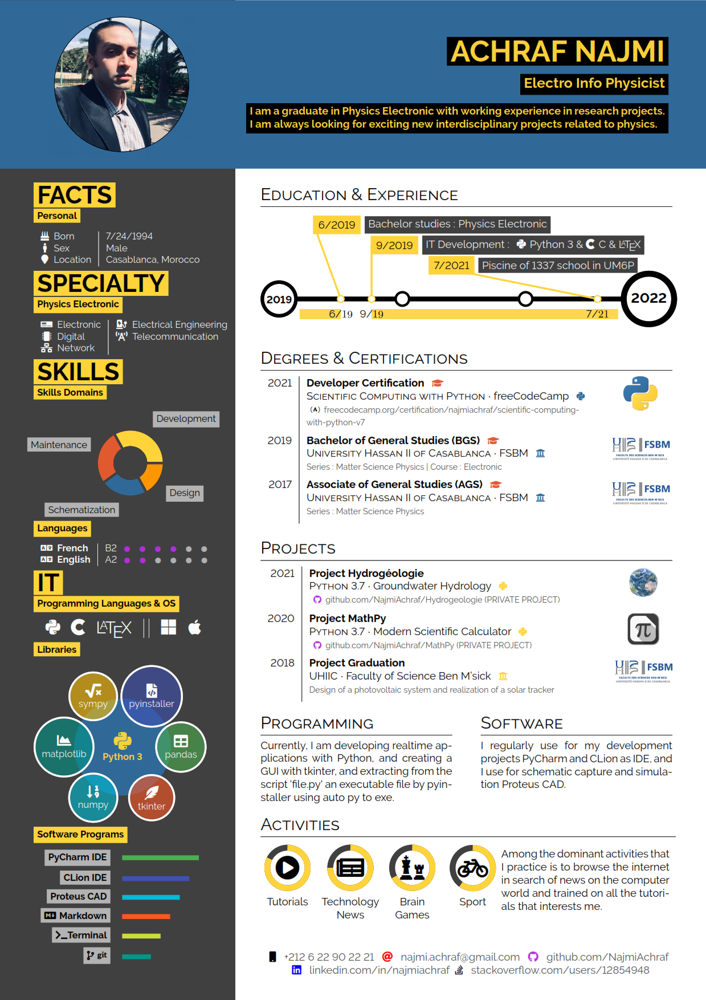

# hipster-cv
Repo to share the template for the Hipster-CV.

*These images are in the CV are pesonal.*
Please replace them with your own photos and logos if you use this template!


# Previews
### Hipster-CV ENGLISH

<table width="100%" margin-left="auto" margin-right="auto">
  <tr>
    <th>darkpython</th>
    <th>lightpython</th>
  </tr>
  <tr>
    <td width="50%">
      
    </td>
    <td width="50%">
      
    </td>
  </tr>
</table>

<table width="100%" margin-left="auto" margin-right="auto">
  <tr>
    <th>darkhipster</th>
    <th>lighthipster</th>
  </tr>
  <tr>
    <td width="50%">
      
    </td>
    <td width="50%">
      
    </td>
  </tr>
</table>

<table width="100%" margin-left="auto" margin-right="auto">
  <tr>
    <th>pastel</th>
    <th>verylight</th>
  </tr>
  <tr>
    <td width="50%">
      
    </td>
    <td width="50%">
      
    </td>
  </tr>
</table>

<table width="100%" margin-left="auto" margin-right="auto">
  <tr>
    <th>allblack</th>
    <th>grey</th>
  </tr>
  <tr>
    <td width="50%">
      
    </td>
    <td width="50%">
      
    </td>
  </tr>
</table>

### Hipster-CV FRANÇAIS

<table width="100%" margin-left="auto" margin-right="auto">
  <tr>
    <th>darkpython</th>
    <th>lightpython</th>
  </tr>
  <tr>
    <td width="50%">
      
    </td>
    <td width="50%">
      
    </td>
  </tr>
</table>

<table width="100%" margin-left="auto" margin-right="auto">
  <tr>
    <th>darkhipster</th>
    <th>lighthipster</th>
  </tr>
  <tr>
    <td width="50%">
      
    </td>
    <td width="50%">
      
    </td>
  </tr>
</table>

<table width="100%" margin-left="auto" margin-right="auto">
  <tr>
    <th>pastel</th>
    <th>verylight</th>
  </tr>
  <tr>
    <td width="50%">
      
    </td>
    <td width="50%">
      
    </td>
  </tr>
</table>

<table width="100%" margin-left="auto" margin-right="auto">
  <tr>
    <th>allblack</th>
    <th>grey</th>
  </tr>
  <tr>
    <td width="50%">
      
    </td>
    <td width="50%">
      
    </td>
  </tr>
</table>

## Usage

This is how to invoke the different color themes

```latex
\documentclass[darkpython]{hipstercv}
% insert whatever style you want to use where it says 'darkpython' now:
% available options are: darkpython, lightpython, darkhipster, lighthipster, pastel, allblack, grey, verylight
```

## License
These CV themes are licensed under a [Creative Commons Attribution-ShareAlike
4.0 International License](http://creativecommons.org/licenses/by-sa/4.0/). This
means that if you change the theme and re-distribute it, you *must* retain the
copyright notice header and license it under the same CC-BY-SA license. This
does not affect the CV that you create with the theme.

